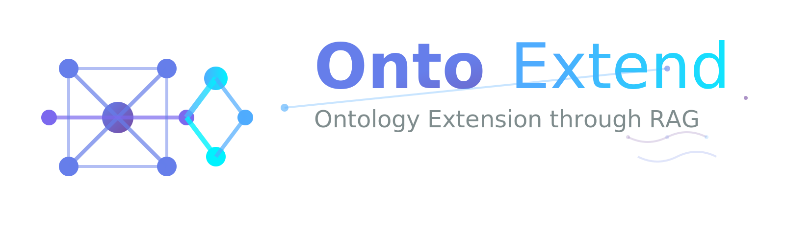

# OntoExtend


<p align="center">
  
</p>

## Ontology Extension through Retrieval-Augmented Generation

OntoExtend automatically generates OWL/SHACL ontology fragments from natural-language **competency questions** (CQs) by retrieving semantically relevant elements from existing reference ontologies and prompting an LLM to compose valid Turtle (TTL) output.  The generated fragments reuse classes, properties, and restrictions already defined in the reference ontologies wherever possible, and only mint new concepts when the CQ demands it.


---

## Table of Contents

1. [Problem & Motivation](#problem--motivation)
2. [How It Works](#how-it-works)
3. [Architecture & Key Classes](#architecture--key-classes)
4. [Installation](#installation)
5. [Configuration](#configuration)
6. [Usage](#usage)
7. [Worked Example](#worked-example)
8. [Prompt Engineering Details](#prompt-engineering-details)
9. [Output Artifacts](#output-artifacts)
10. [Extending OntoExtend](#extending-ontoextend)
11. [License](#license)

---

## Problem & Motivation

Ontology engineering is labour-intensive. Domain experts formulate **competency questions** -- natural-language questions the ontology must be able to answer (e.g. *"What materials does a fibre contain?"*) -- but translating each CQ into formal OWL axioms requires specialist knowledge.  OntoExtend bridges this gap:

| Manual process | OntoExtend |
|---|---|
| Expert reads CQ, browses existing ontologies, hand-writes Turtle | System **embeds** the CQ, **retrieves** the most relevant ontology elements from a vector store, and **prompts** an LLM to compose a valid TBox fragment |
| Difficult to ensure reuse of existing ontology elements | Retrieved snippets are injected into the prompt so the LLM sees the exact IRIs and definitions to reuse |
| Each CQ processed in isolation | Fragments generated for earlier CQs can be **cached** and retrieved for later CQs (`--include-cache`) |

---

## How It Works

The pipeline is implemented in `OntologyRAG` (in [`OntoExtend Script/rag-ontoextend.py`](OntoExtend%20Script/rag-ontoextend.py)).  Below is a step-by-step walkthrough of what happens when you run a single CQ.

### Step 1 -- Parse reference ontologies

`OntologyExtractor` reads every `.ttl` / `.owl` file you supply and produces a list of `OntologyElement` objects -- one per class, property, restriction, or SHACL shape.

```
OntologyExtractor._extract_single(ontology_file)
  -> rdflib.Graph.parse(ontology_file)
  -> iterate over owl:Class, owl:ObjectProperty, owl:DatatypeProperty,
     owl:AnnotationProperty, sh:NodeShape, sh:PropertyShape, owl:Restriction
  -> for each: create an OntologyElement with uri, label, comment,
     domain/range, super/sub classes, and a _collect_snippet() TTL fragment
```

Each element carries a **Turtle snippet** -- the serialised triples for that element produced by `rdflib` -- so the LLM later sees the exact original definition:

```turtle
# snippet for :hasMaterialComponent from the material module
:hasMaterialComponent rdf:type owl:ObjectProperty ;
    rdfs:domain :Material ;
    rdfs:range :MaterialComponent ;
    rdfs:comment "hasMaterialComponent intends to represent that a material
                  can have a collection of components." ;
    rdfs:label "has material component" .
```

### Step 2 -- Build searchable text & embed

Every `OntologyElement` is turned into a searchable string via `get_searchable_text()`:

```
hasMaterialComponent | has material component | hasMaterialComponent intends
to represent that a material can have a collection of components. | Type:
object property | Domain: Material | Range: MaterialComponent
```

This string is then embedded (OpenAI `text-embedding-3-small` by default, 1536 dimensions).  The resulting vector is L2-normalised and inserted into a **FAISS `IndexFlatIP`** (inner-product index, which equals cosine similarity after normalisation).

### Step 3 -- Embed the CQ & retrieve top-K

The competency question (e.g. *"What is the composition of a material?"*) is embedded with the same model.  A FAISS search returns the **top-K** most similar `OntologyElement` records (default K=20).  Results are filtered to allowed sources (reference ontologies + optionally cached session fragments).

### Step 4 -- Build the prompt

`PromptBuilder` assembles a structured prompt with four sections:

1. **System message** -- establishes the ontology-engineer persona and output format.
2. **Prefix block** -- all `@prefix` declarations collected from the reference ontologies by `PrefixManager`, so the LLM can use the correct namespaces.
3. **Retrieved elements** -- grouped by source ontology, each with its searchable text description and the original Turtle snippet inside a fenced code block.
4. **Instructions & CQ** -- a numbered list of constraints (reuse existing elements, include domain/range on every property, use OWL restrictions or SHACL as appropriate, etc.) followed by the CQ text itself.

See [Prompt Engineering Details](#prompt-engineering-details) for the full template.

### Step 5 -- Call the LLM

The prompt is sent via `LLMService.complete()` (supports OpenAI API, Azure corporate endpoints, or a local server such as Ollama/LMStudio).  The response is expected to contain a single fenced ```` ```ttl ```` block.  The system extracts the block contents with a regex.

### Step 6 -- Validate, save, and index

1. **`TurtleValidator`** parses the fragment with `rdflib` to confirm it is syntactically valid Turtle.
2. **`PropertyConstraintValidator`** checks that every `owl:ObjectProperty` and `owl:DatatypeProperty` in the fragment has explicit `rdfs:domain` and `rdfs:range` statements.
3. The validated fragment is written to `~/.core_ontology_rag_cache/individual_ontologies/<basename>.ttl`.
4. The new fragment's elements are **extracted and indexed** back into the FAISS store so that subsequent CQs can retrieve and reuse them (`--include-cache`).

### Step 7 (batch mode) -- Combine fragments

When processing a CSV of CQs, `OntologyCombiner.combine()` concatenates all individual fragments under a shared prefix block and ontology header, producing a single `combined_ontology.ttl`.


---

## Architecture & Key Classes

All core logic lives in [`OntoExtend Script/rag-ontoextend.py`](OntoExtend%20Script/rag-ontoextend.py) and its two helper modules [`llm_service.py`](OntoExtend%20Script/llm_service.py) and [`embedder.py`](OntoExtend%20Script/embedder.py).

| Class | File | Responsibility |
|---|---|---|
| **`OntologyElement`** | `rag-ontoextend.py` | Pydantic model representing one ontology construct (class, property, restriction, or SHACL shape).  Carries the URI, metadata, and a Turtle snippet.  `get_searchable_text()` produces the string that is embedded. |
| **`OntologyExtractor`** | `rag-ontoextend.py` | Parses TTL/OWL files with `rdflib`, iterates over `owl:Class`, `owl:ObjectProperty`, `owl:DatatypeProperty`, `owl:AnnotationProperty`, `sh:NodeShape`, `sh:PropertyShape`, and `owl:Restriction`, producing `OntologyElement` instances.  `_collect_snippet()` serialises a subgraph for each element. |
| **`FaissVectorStore`** | `rag-ontoextend.py` | Wraps a FAISS `IndexFlatIP` index.  Provides `add(vec, element)` with URI-based deduplication and `search(vec, k)` returning `(OntologyElement, score)` tuples. |
| **`PrefixManager`** | `rag-ontoextend.py` | Collects all namespace prefixes from the reference ontology files and builds a `@prefix` block string.  Sanitises non-standard prefix names. |
| **`PromptBuilder`** | `rag-ontoextend.py` | Formats the retrieved elements (grouped by source ontology, with Turtle snippets) and fills the `USER_TMPL` template with the CQ, prefix block, and element text. |
| **`TurtleValidator`** | `rag-ontoextend.py` | Attempts to parse a TTL string with `rdflib`; returns `True` if parsing succeeds. |
| **`PropertyConstraintValidator`** | `rag-ontoextend.py` | Parses the fragment and checks that every `owl:ObjectProperty` / `owl:DatatypeProperty` has both `rdfs:domain` and `rdfs:range`. |
| **`OntologyCombiner`** | `rag-ontoextend.py` | Strips per-fragment prefix lines and concatenates fragments under a shared header with metadata comments. |
| **`OntologyRAG`** | `rag-ontoextend.py` | Orchestrator.  Owns the extractor, embedder, vector store, LLM service, and logger.  Exposes `run_single_cq()` and `run_csv()`. |
| **`RunLogger`** | `rag-ontoextend.py` | Writes four CSV log files (see [Output Artifacts](#output-artifacts)). |
| **`TokenCostTracker`** | `llm_service.py` | Tracks prompt/completion/embedding token counts per model; computes USD cost estimates from `llm_costs.yaml`. |
| **`OpenAILLMService`** | `llm_service.py` | Async wrapper around `openai.AsyncOpenAI().chat.completions.create()`.  Supports custom `base_url` for local models. |
| **`CorporateLLMService`** | `llm_service.py` | Azure-based LLM via `helpers.azure_openai.init_chat_model()`. |
| **`OpenAIEmbedder`** | `embedder.py` | Async batch embedder using `openai.AsyncOpenAI().embeddings.create()`. |
| **`HuggingFaceEmbedder`** | `embedder.py` | Local embedder via `langchain_huggingface.HuggingFaceEmbeddings` (no API calls). |


---

## Installation

### Prerequisites

- Python 3.10+
- An OpenAI API key/Azure (or a locally running LLM server)

### Steps

```bash
# Clone
git clone https://github.com/dersuchendee/OntoExtend.git
cd OntoExtend

# Create a virtual environment
python -m venv .venv
source .venv/bin/activate        # macOS / Linux
# .venv\Scripts\activate         # Windows

# Install dependencies
pip install -r requirements.txt
```

### Dependencies

| Package | Version | Purpose |
|---|---|---|
| `rdflib` | 7.2.1 | Parse and serialise RDF/OWL/Turtle graphs |
| `faiss-cpu` | 1.12.0 | FAISS vector similarity search |
| `openai` | 0.27.8 | OpenAI API for chat completions and embeddings |
| `pydantic` | 2.12.0 | Data validation for `OntologyElement` |
| `pandas` | 1.5.3 | CSV reading for batch mode |
| `tiktoken` | 0.12.0 | Token counting for cost estimation |
| `langchain_huggingface` | 0.3.1 | Local HuggingFace embedding models |
| `owlready2` | 0.48 | OWL reasoning (used by the OntoDESIDE variant) |
| `rich` | 14.1.0 | Formatted terminal output |
| `python-dotenv` | 1.1.1 | Load `.env` configuration |
| `PyYAML` | 6.0.3 | Parse `llm_costs.yaml` for token pricing |
| `numpy` | 2.3.3 | Numerical operations for embeddings |
| `tqdm` | 4.64.1 | Progress bars for batch processing |
| `ollama` | 0.6.0 | Optional local LLM via Ollama |
| `Flask` | 2.2.2 | Optional REST API wrapper |

---

## Configuration

### 1. Create the `.env` file

```bash
cp env_template .env
```

### 2. Edit `.env`

The file controls three things: **which LLM to call**, **which embedder to use**, and **cost tracking**.

```bash
# ── LLM ──────────────────────────────────────────────
LLM_SERVICE = "openai"            # "openai" | "corporate"
LLM_MODEL   = "gpt-4o"           # any model name the service accepts
LLM_TEMPERATURE = 0              # 0 = deterministic; 1 = creative
OPENAI_API_KEY  = "sk-..."       # required when LLM_SERVICE=openai

# ── Embedder ─────────────────────────────────────────
EMBEDDER   = "openai"            # "openai" | "huggingface" | "corporate-openai"
EMBED_MODEL = "text-embedding-3-small"
VECTOR_DIM  = 1536               # must match the model's output dimensionality

# ── Cost tracking (optional) ─────────────────────────
LLM_COSTS_FILE = "./llm_costs.yaml"
```

### Alternative: local LLM via Ollama or LMStudio

```bash
LLM_SERVICE  = "openai"
LLM_BASE_URL = "http://127.0.0.1:1234/v1"   # point to local server
LLM_MODEL    = "deepseek-r1"
LLM_TEMPERATURE = 0.7
```

When `LLM_BASE_URL` is set, the OpenAI client sends requests to that URL instead of `api.openai.com`.  This works with any OpenAI-compatible local server (Ollama `ollama serve`, LMStudio, vLLM, etc.).

### Alternative: local embeddings via HuggingFace

```bash
EMBEDDER   = "huggingface"
EMBED_MODEL = "all-MiniLM-L6-v2"
VECTOR_DIM  = 384                # MiniLM produces 384-dim vectors
```

No API key is needed; the model is downloaded and run locally.

### Cost configuration (`llm_costs.yaml`)

Prices are defined per **1 million tokens**:

```yaml
gpt-4o:
  input: 2.5
  output: 10.0
o4-mini:
  input: 0.5
  output: 2.0
text-embedding-3-small:
  input: 0.02
```

The tracker logs per-CQ token counts and estimated USD cost to `token_cost_log.csv`.

---

## Usage

All commands are run from the repository root.

### Single competency question

```bash
python "OntoExtend Script/rag-ontoextend.py" cq \
  --cq "What materials does a fibre contain?" \
  --onto Dataset/OntoDESIDECoreOntology/material.ttl \
        Dataset/OntoDESIDECoreOntology/product.ttl \
  --top-k 20
```

| Flag | Description |
|---|---|
| `--cq` | The natural-language competency question (required) |
| `--onto` | One or more reference ontology files (`.ttl` or `.owl`) |
| `--onto-dir` | One or more directories to scan recursively for `.ttl`/`.owl` files |
| `--top-k` | Number of ontology elements to retrieve (default 20) |
| `--include-cache` | Also retrieve from previously generated CQ fragments stored on disk |

`--onto` and `--onto-dir` can be combined freely; all discovered files are deduplicated.

### Batch processing from CSV

```bash
python "OntoExtend Script/rag-ontoextend.py" csv \
  --file Dataset/cqs.csv \
  --onto-dir Dataset/OntoDESIDECoreOntology \
  --top-k 20 \
  --limit 5 \
  --include-cache
```

The CSV must contain a column named **`CQ`**.  An optional **`CQID`** (or `cq_id`, `ID`, etc.) column is used in output file names.

```csv
CQ
"What materials does a fibre contain?"
"What products (fibers) are in my library?"
"What resources are used in the assembly process of a fiber and what are the quantities of these resources?"
```

| Flag | Description |
|---|---|
| `--file` | Path to the CSV (required) |
| `--limit` | Process only the first N rows (omit to process all) |

In batch mode each CQ is processed sequentially.  When `--include-cache` is set, the fragment generated for CQ *n* is indexed and becomes available for retrieval when processing CQ *n+1*.

---

## Worked Example

This section walks through a concrete run so you can see exactly what the system produces at each stage.

### Input

**CQ:** *"What is the composition of a material?"*

**Reference ontology:** `Dataset/OntoDESIDECoreOntology/material.ttl` (the CEON Material module), which defines:

```turtle
:Material a owl:Class ;
    rdfs:label "Material" ;
    rdfs:comment "A material is a substance or a mix of substances." .

:hasMaterialComponent a owl:ObjectProperty ;
    rdfs:domain :Material ;
    rdfs:range :MaterialComponent ;
    rdfs:comment "hasMaterialComponent intends to represent that a material
                  can have a collection of components." ;
    rdfs:label "has material component" .

:MaterialComponent a owl:Class ;
    rdfs:label "Material Component" ;
    rdfs:comment "A material component represents one constituent of a material
                  composition, linking a material type to its proportion." .
```

### Step-by-step

1. **Extract** -- The extractor pulls 15 `OntologyElement` objects from `material.ttl` (classes like `Material`, `MaterialComponent`, `ChemicalEntity`; properties like `hasMaterialComponent`, `hasChemicalEntity`, `anonymousFormula`; etc.).

2. **Embed & index** -- Each element's `get_searchable_text()` is embedded.  For example, the text for `hasMaterialComponent` is:

   ```
   hasMaterialComponent | has material component | hasMaterialComponent intends
   to represent that a material can have a collection of components. | Type:
   object property | Domain: Material | Range: MaterialComponent
   ```

3. **Retrieve** -- The CQ *"What is the composition of a material?"* is embedded.  The top-5 results (by cosine similarity) might be:

   | Rank | Element | Score |
   |---|---|---|
   | 1 | `:hasMaterialComponent` (object property) | 0.82 |
   | 2 | `:MaterialComponent` (class) | 0.79 |
   | 3 | `:Material` (class) | 0.77 |
   | 4 | `:hasChemicalEntity` (object property) | 0.71 |
   | 5 | `:ChemicalEntity` (class) | 0.68 |

4. **Prompt** -- The builder assembles the prompt (abbreviated):

   ```
   You are a helpful assistant designed to generate ontologies. ...

   Use the following prefixes:
   @prefix : <http://w3id.org/CEON/ontology/material/> .
   @prefix owl: <http://www.w3.org/2002/07/owl#> .
   ...

   INSTRUCTIONS:
   1. Analyze the CQ to understand what concepts and relationships are needed
   2. Map the required concepts to classes/properties from the RELEVANT
      ONTOLOGY ELEMENTS above
   ...

   COMPETENCY QUESTION: "What is the composition of a material?"

   RELEVANT ONTOLOGY ELEMENTS (from 1 reference ontologies):

   ## From material ontology:
   - hasMaterialComponent | has material component | ... | Type: object property
     | Domain: Material | Range: MaterialComponent
     ```ttl
     :hasMaterialComponent rdf:type owl:ObjectProperty ;
         rdfs:domain :Material ;
         rdfs:range :MaterialComponent ;
         rdfs:label "has material component" .
     ```
   - MaterialComponent | Material Component | ...
     ```ttl
     :MaterialComponent rdf:type owl:Class ;
         rdfs:label "Material Component" .
     ```
   ...
   ```

5. **LLM response** -- The model returns a fenced Turtle block:

   ```turtle
   @prefix : <http://w3id.org/CEON/ontology/material/> .
   @prefix owl: <http://www.w3.org/2002/07/owl#> .
   @prefix rdfs: <http://www.w3.org/2000/01/rdf-schema#> .
   @prefix xsd: <http://www.w3.org/2001/XMLSchema#> .

   :Material a owl:Class ;
       rdfs:subClassOf [
           a owl:Restriction ;
           owl:onProperty :hasMaterialComponent ;
           owl:someValuesFrom :MaterialComponent
       ] ;
       rdfs:label "Material" ;
       rdfs:comment "A material is a substance or a mix of substances." .

   :MaterialComponent a owl:Class ;
       rdfs:label "Material Component" ;
       rdfs:comment "One constituent of a material composition." .

   :hasMaterialComponent a owl:ObjectProperty ;
       rdfs:domain :Material ;
       rdfs:range :MaterialComponent ;
       rdfs:label "has material component" .

   :componentProportion a owl:DatatypeProperty ;  # GENERATED
       rdfs:domain :MaterialComponent ;
       rdfs:range xsd:decimal ;
       rdfs:label "component proportion" ;
       rdfs:comment "The proportion of this component in the material composition." .
   ```

6. **Validate & save** -- The fragment parses successfully; all properties have domain and range.  Saved to `~/.core_ontology_rag_cache/individual_ontologies/cq001_material.ttl`.

---

## Prompt Engineering Details

The system uses a two-message chat structure: a **system prompt** and a **user prompt**.

### System prompt

```
You are an ontology engineer. Reuse elements from the provided core ontology
when possible. If you must create new elements, append '# GENERATED' as a
comment. Return only Turtle/TTL syntax inside one markdown code block.
```

### User prompt template

The full templates are defined in `USER_TMPL` in ([OntoExtend%20Script/rag-ontoextend.py#L94-L155](https://github.com/dersuchendee/OntoExtend/tree/main/OntoExtend%20Script/OntoExtender/Prompting%20Techniques/Components/PromptTemplate)).  


---

## Output Artifacts

All outputs are stored under `~/.core_ontology_rag_cache/` by default.

```
~/.core_ontology_rag_cache/
 ├── individual_ontologies/        # One .ttl file per CQ
 │    ├── cq001_material.ttl
 │    ├── cq002_material-product.ttl
 │    └── ...
 ├── retrieved_elements/           # Debug CSVs showing what was retrieved per CQ
 │    ├── cq001_material_retrieved.csv
 │    └── ...
 ├── <csv-stem>_<onto-tag>_combined.ttl   # All fragments merged (batch mode)
 ├── generation_runs.csv           # Summary: total CQs, success rate, time
 ├── cq_processing_log.csv         # Per-CQ: success flag, elements used, time
 ├── token_cost_log.csv            # Per-CQ: tokens consumed, estimated USD
 └── ontology_elements.csv         # All extracted elements with metadata
```

### Log file schemas

**`generation_runs.csv`**

| Column | Example |
|---|---|
| `timestamp` | `2025-09-04T15:08:16` |
| `total_cqs` | `5` |
| `successful` | `5` |
| `failed` | `0` |
| `success_rate_percent` | `100.0` |
| `total_time_minutes` | `0.05` |
| `avg_time_per_cq_seconds` | `0.60` |

**`token_cost_log.csv`**

| Column | Example |
|---|---|
| `cq_index` | `1` |
| `cq` | `What materials does a fibre contain?` |
| `model` | `gpt-4o` |
| `prompt_tokens` | `3842` |
| `completion_tokens` | `512` |
| `embedding_tokens` | `1024` |
| `cost_usd` | `0.014725` |

---

## Extending OntoExtend

### Adding a new LLM provider

1. Subclass `LLMService` in [`llm_service.py`](OntoExtend%20Script/llm_service.py) and implement the `async complete(prompt, system_prompt) -> str` method.
2. Register the new service type in `get_llm_service()`.
3. Set `LLM_SERVICE` in `.env` to match the new type string.

```python
class MyCustomLLMService(LLMService):
    async def complete(self, prompt: str, system_prompt: str) -> str:
        # call your endpoint, track tokens via self.tracker.note_chat()
        ...
        return response_text
```

### Adding a new embedding provider

1. Subclass `Embedder` in [`embedder.py`](OntoExtend%20Script/embedder.py) and implement `embed_one()` and `embed_many()`.
2. Register in `get_embedder()`.
3. Set `EMBEDDER`, `EMBED_MODEL`, and `VECTOR_DIM` in `.env`.


---

## License

This project is licensed under the Apache License 2.0 -- see the [LICENSE](LICENSE) file for details.

Licensed under the Apache License, Version 2.0 (the "License");
you may not use this file except in compliance with the License.
You may obtain a copy of the License at

    http://www.apache.org/licenses/LICENSE-2.0

Unless required by applicable law or agreed to in writing, software
distributed under the License is distributed on an "AS IS" BASIS,
WITHOUT WARRANTIES OR CONDITIONS OF ANY KIND, either express or implied.
See the License for the specific language governing permissions and
limitations under the License.
