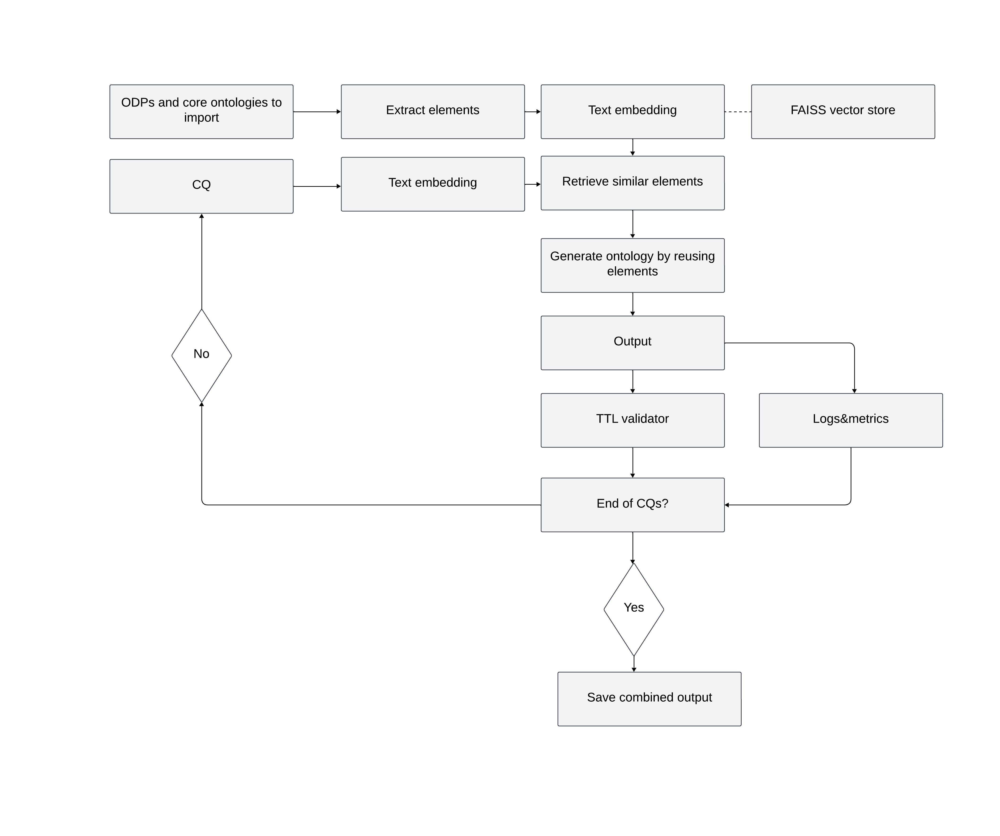

# OntoExtend 

## 🧠 Ontology Extension through Retrieval-Augmented Generation

OntoExtend is a Python-based system that automatically generates ontology extensions from competency questions using retrieval-augmented generation (RAG). The system leverages existing ontology design patterns (ODPs) and core ontologies to create semantically consistent TTL/OWL fragments.




## Quick Start

### Prerequisites

```bash
# Python 3.8+
python --version

# Required packages
pip install faiss-cpu numpy openai pandas pydantic rdflib rich tiktoken tqdm
```

### Environment Setup

```bash
# Set your OpenAI API key
export OPENAI_API_KEY="your-api-key-here"

# Optional: Set custom pricing (if different from defaults)
export PRICE_GPT_4O_INPUT_PER_1K=0.0025
export PRICE_GPT_4O_OUTPUT_PER_1K=0.0100
```

### Basic Usage

#### Prerequisites: Reference Ontologies or ODPs
Before running OntoExtend, you need reference ontologies (core ontologies/ODPs) for the system to extend from. The system requires existing ontology files in TTL or OWL format to use as knowledge base. Competency questions are needed as they serve as new requirements to extend the ontology.

#### Single Competency Question
```bash
python tidied_rag_ontology.py cq \
  --cq "What properties does a building have?" \
  --onto core.ttl patterns.ttl \
  --top-k 20
```

#### Batch Processing from CSV
```bash
python tidied_rag_ontology.py csv \
  --file competency_questions.csv \
  --onto-dir ./ontologies \
  --limit 50 \
  --top-k 20
```

## Input/Output Format

### Input: Competency Questions CSV
```csv
CQ
"What are the properties of a building?"
"How do sensors relate to their measurements?"
"What temporal relationships exist in events?"
```

### Output: Generated TTL
```turtle
@prefix : <http://www.example.org/ontology#> .
@prefix owl: <http://www.w3.org/2002/07/owl#> .
@prefix rdfs: <http://www.w3.org/2000/01/rdf-schema#> .

:Building a owl:Class ;
    rdfs:label "Building" ;
    rdfs:comment "A structure with walls and a roof" .

:hasProperty a owl:ObjectProperty ;
    rdfs:domain :Building ;
    rdfs:range :Property .
```

## Configuration Options

| Parameter | Description | Default |
|-----------|-------------|---------|
| `--top-k` | Number of similar elements to retrieve | 20 |
| `--limit` | Maximum CQs to process (CSV mode) | None |
| `--onto` | Individual ontology files | Required |
| `--onto-dir` | Directories to scan for ontologies | Optional |

## Performance & Costs

The system tracks comprehensive metrics including:

- **Processing time** per competency question
- **API token usage** and cost estimates
- **Success/failure rates** with error categorization
- **Ontology source utilization** statistics

**⭐ Star this repository if you find it useful!**
